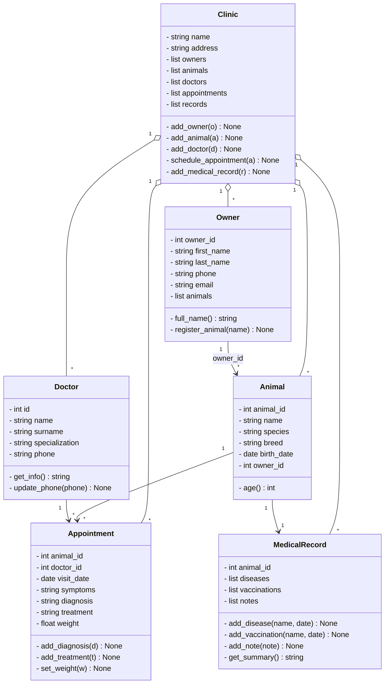

# IO_VET_CLINIC
Aplikacja konsolowa w Pythonie, stworzona jako projekt zaliczeniowy przedmiotu Inżynieria Oprogramowania.
Służy do zarządzania kliniką weterynaryjną - rejestrowania pacjentów i ich właścicieli, przypisywania lekarzy, planowania wizyt oraz prowadzenia historii medycznej zwierząt. Projekt został wykonany przez trzyosobowy zespół z wykorzystaniem GitHub Flow.

## Spis treści

1. Wymagania projektu
2. Opis funkcjonalności
3. Struktura projektu
4. Diagram klas (UML)
5. Instalacja
6. Testowanie i przykład użycia
8. Zespół, obowiązki oraz praca z GitHub

## 1. Wymagania projektu

Projekt musiał spełniać wymagania w czterech obszarach:
1. Model dziedzinowy - co najmniej 5 klas, z określonymi typami atrybutów oraz wartości zwracanych przez metody.
2. Kod i dokumentacja - czytelna struktura projektu podzielona na kilka plików, docstringi do każdej klasy/funkcji oraz plik README.
3. Testy - co najmniej 15 testów jednostkowych oraz 3 testy integracyjne.
4. Praca z GitHub - utworzenie gałęzi main, dev i funkcjonalności przypisanych do osób, oraz praca w systemie z Pull Request i co najmniej jednym review przed scaleniem.


## 2. Opis funkcjonalności

Stworzono model dziedzinowy składający się wraz z głównym pakietem `clinic` z sześciu klas.
| Klasa | Opis funkcjonalności |
|---|---|
| `Animals` | pacjent kliniki. Przechowuje: id zwierzęcia, imię, gatunek, rasę, datę urodzenia i id właściciela. Każde nowe zwierzę dostaje automatycznie numer `animal_id` (licznik klasowy). Metoda `age() -> int` liczy aktualny wiek na podstawie daty urodzenia zwierzęcia i aktualnej daty.|
| `Owners` | właściciel zwierzęcia. Przechowuje: id właściciela, imię, nazwisko, numer telefonu, adres email oraz listę zarejestrowanych zwierząt. `full_name() -> str` zwraca imię i nazwisko właściciela, `register_animal(animal_name: str) -> None` dopisuje zwierzaka do listy właściciela. |
| `Doctors` | lekarz weterynarii. Przechowuje: id lekarza, imię, nazwisko, specjalizacje i numer telefonu. `get_info() -> str` zwraca dane lekarza w jednym tekście, `update_phone(new_phone: str) -> None` pozwala zaktualizować numer kontaktowy. |
| `Appointments` | wizyta. Przechowuje: id zwierzęcia, id lekarza, datę wizyty, objawy, diagnozę, sposób leczenia i opcjonalnie wagę zwierzęcia (typ float, może być nieustawiona). Metody `add_diagnosis()`, `add_treatment()` i `set_weight()` pozwalają uzupełnić dane po wizycie, bez tworzenia nowego obiektu. |
| `MedicalRecord` | historia medyczna danego zwierzęcia. Przechowuje: id zwierzęcia, listy chorób, szczepień i notatek. `add_disease()` i `add_vaccination()` przyjmują opcjonalną datę – jeśli jej nie podamy, używana jest dzisiejsza. `get_summary() -> str` zwraca krótkie podsumowanie (liczbę wpisów w każdej kategorii). `add_note() -> str` dodaje notatkę medyczną z wizyty. |
| `Clinic` | łączy wszystko w jedno. Przechowuje: listy właścicieli, zwierząt, lekarzy, wizyt i kart medycznych, i udostępnia proste metody `add_owner()`, `add_animal()`, `add_doctor()`, `schedule_appointment()`, `add_medical_record()` do rejestrowania ich w klinice. |


## 3. Struktura projektu

Struktura projektu została dobrana w taki sposób, aby każda klasa i idące za nią funkcjonalności mogły zostać stworzone w obrębie osobnych branchy. Wszystkie klasy dziedzinowe znajdują się w folderze clinic, każda w odrębnym pliku, a plik clinic.py importuje je i łączy w jedną całość za pomocą klasy Clinic.

```
IO_VET_CLINIC
├── clinic
│   ├── animals.py          # klasa Animal
│   ├── owners.py           # klasa Owner
│   ├── doctors.py          # klasa Doctor
│   ├── appointments.py     # klasa Appointment
│   ├── medical_record.py   # klasa MedicalRecord
│   └── clinic.py           # klasa Clinic
├── tests                   # zawiera testy jednostkowe dla każdej klasy
│   ├── test_animal.py
│   ├── test_appointments.py
│   ├── test_doctors.py
│   ├── test_medical_record.py
│   └── test_clinic.py      # zawiera także testy integracyjne
├── test_run.py             # demo aplikacji
├── .gitignore
└── README.md               # opis projektu
```


## 4. Diagram klas



## 5. Instalacja

Cała logika aplikacji oparta jest na standardowej bibliotece Pythona (m.in. `datetime`), więc nie wymaga się instalacji żadnej dodatkowej. Jedyna zależność potrzebna jest do uruchomienia testów.

## 6. Testowanie i przykład użycia

Testy jednostkowe znajdują się w katalogu `tests` i składają się z jednego pliku testowego przypadającego na każdą klasę. Łącznie stworzono więc 22 takie testy, oraz 3 testy integralne, w tym dwa scenariusze w `test_clinic` (`test_full_flow`, `test_full_flow_with_medical_history`). Nie testują one pojedynczej klasy, a cały  proces, sprawdzając całkowitą współpracę między klasami. 

W pliku `test_run.py` znajduje się skrypt demonstringujący prosty przepływ działania programu od rejestringacji właściciela, zwierzaka, lekarza, po umawienie wizyty i dodanie wpisu do historii medycznej.

## 7. Zespół, obowiązki oraz praca z Github

Projekt został wykonany przez 3-osobowy zespół:

| Osoba | Nazwa konta GitHub | Obowiązki |
|---|---|---|
| Katarzyna Ceglewska | 103100k8 | klasy `Animal` i `Owner` oraz ich testy jednostkowe, konfiguracja repozytorium |
| Maja Ślendak | Maja103105 | klasy `Doctor` i `Appointment` oraz ich testy jednostkowe i test integracyjny |
| Marek Świderek | kieriam | klasa `MedicalRecord` i `Clinic` oraz ich testy jednostkowe i testy integracyjne |


Repozytorium składa się z dwóch głównych gałęzi - `main` i `dev`. Każdą funkcjonalność rozwijano na osobnych gałęziach, których nazwy bezpośrednio nawiązywały do nazw realizowanych funkcjonalności (`doctors`,`owner`,`animal`, `appointments`, `clinic`, `feature_medical_record`). Każdy członek zespołu pracował na własnym branchu, wystawiając po skończonym zadaniu PR do `dev` i czekając na review od współpracowników przed zmergowaniem zmian. Dopiero po zamknięciu etapu prac, branch `dev` został scalony do czystego branchu `main`. 